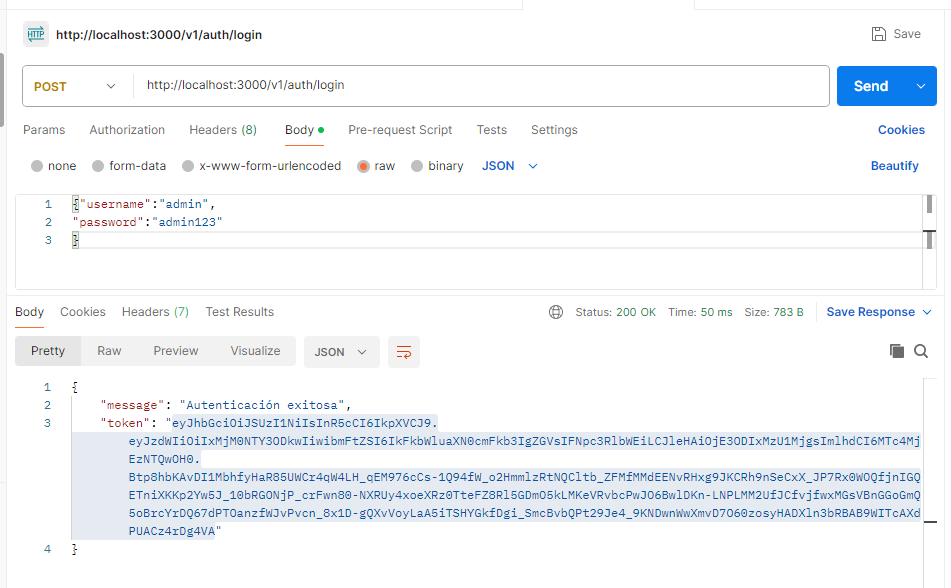
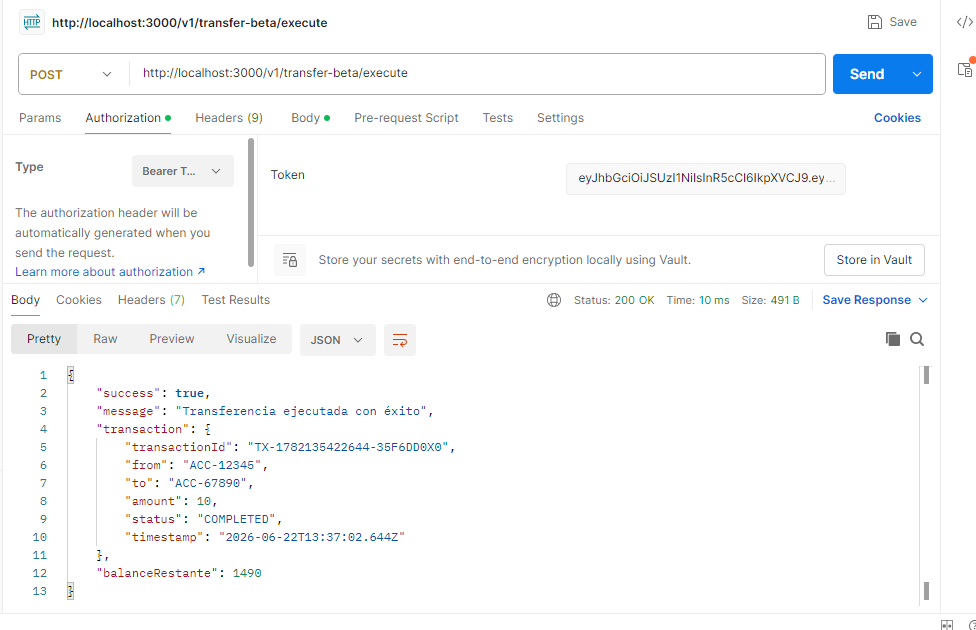
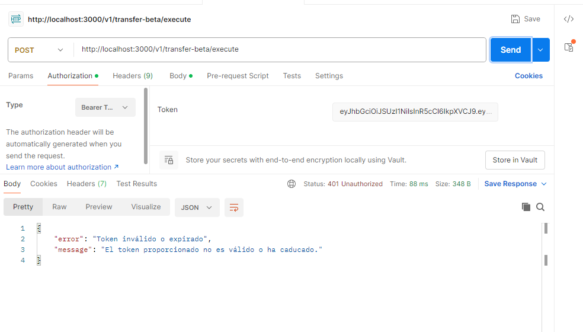
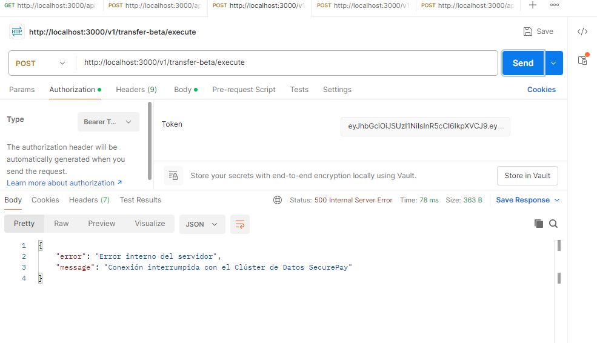
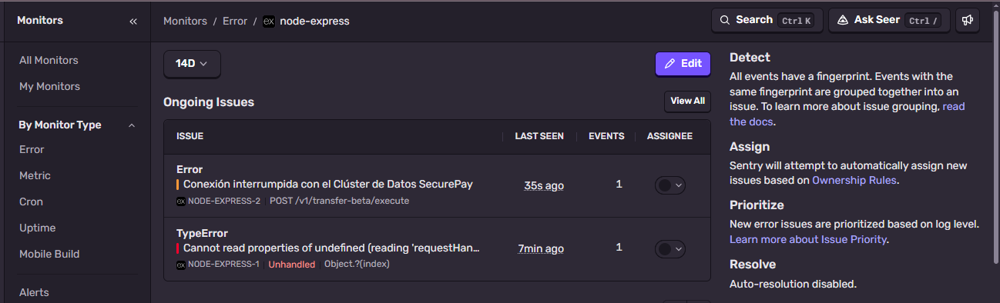

# Bitácora de Evaluación — Fintech SecurePay Base

Este README actúa como registro de la evaluación: contiene pasos para reproducir, comandos usados y las capturas realizadas con Postman y Sentry.

## Pasos rápidos para reproducir localmente

1. Generar pares de claves (si no existen):

```bash
chmod +x ./keypair.sh
./keypair.sh
```

2. Instalar dependencias e iniciar el servidor:

```bash
npm install
npm start
```

3. Obtener token (credenciales de prueba):

```bash
curl -X POST http://localhost:3000/v1/auth/login \
	-H "Content-Type: application/json" \
	-d '{"username":"admin","password":"admin123"}'
```

4. Usar el token en endpoints protegidos (ejemplo obtener saldo):

```bash
curl -H "Authorization: Bearer <TOKEN>" "http://localhost:3000/v1/account-alpha/balance?accountId=ACC-12345"
```


## Capturas

- Token generado (Postman):



- Petición con token válido — transferencia exitosa (Postman):



- Petición con token inválido/expirado (Postman):



- Petición POST que simula el error operacional 500 (Postman):



- Panel Sentry mostrando el Error Operacional y Tags (user.id):




## Notas de observabilidad

- Los errores lógicos de autenticación (token malformado o expirado) son manejados por el middleware y devuelven HTTP 401 sin enviar un evento de crash a Sentry.
- El error operacional intencional (`Conexión interrumpida con el Clúster de Datos SecurePay`) se envía a Sentry y en los Tags aparece `user.id` tomado del JWT.

---

Fecha de la bitácora: 2026-06-22

